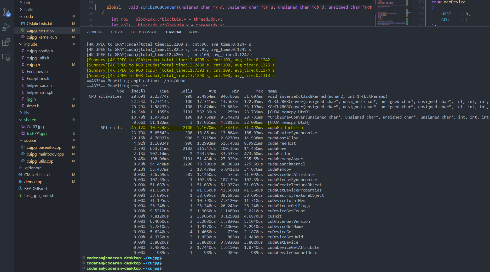

# CuJPG: 基于CUDA加速的JPEG解码库

主要用于Jetson系列板卡嵌入式开发应用。由USB摄像头捕获MJPG图像后，由本模块进行CPU+GPU混合解码，解码结果将滞留显存，然后可以直接送入TensorRT模块进行神经网络推理，降低系统延迟。

目前已在Jetson Nano 4G上测试工作正常，CUDA解码时间整体略长于CPU解码时间。但从API统计时间看，CUDA解码时间主要花费在内存与显存的数据交换，若不计数据交换时间，CUDA解码时间远低于CPU解码时间。即使使用CPU解码，后期在进行TensorRT推理时不可避免也要进行内存与显存的数据交换。因此具体情况如何，有待进一步测试。

* 已完成：
    * Jetson Nano 4G上基准测试
* 下步计划：
    * Jetson NX 上进行基准测试
    * 结合V4L2接口开发低延迟视频流采集、解码系统(umm..暂且命名为JetCudaCamera?)
    * 更完善的文档

4K JPEG图像Jetson Nano 4G上基准测试结果：
